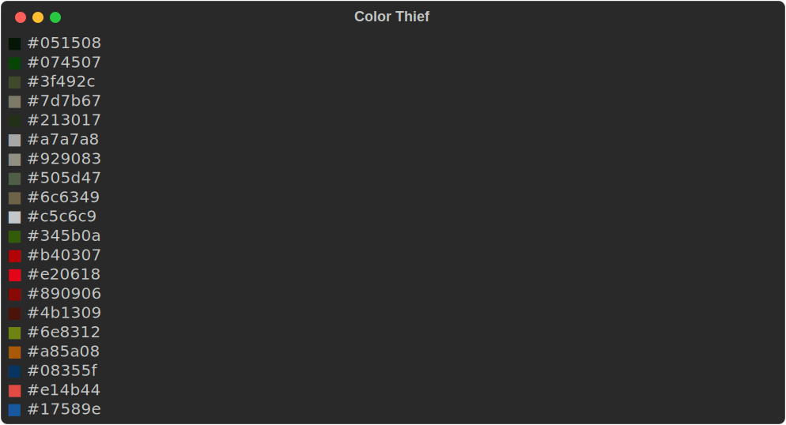

# Color Thief

Extract a color palette from an image.

## Usage

```text
usage: __main__.py [-h] [-c COUNT] [-a {kmeans[RGB],kmeans[LAB],regular}] [-o OUTPUT] src

positional arguments:
  src                   Path to image file

options:
  -h, --help            show this help message and exit
  -c COUNT, --count COUNT
                        Number of colors to return
  -a {kmeans[RGB],kmeans[LAB],regular}, --algo {kmeans[RGB],kmeans[LAB],regular}
                        Algorithm to use
  -o OUTPUT, --output OUTPUT
                        Path to output file
```

## Example


```bash
python -m color_thief assets/photo.jpg -o assets/terminal.svg -c 20
```


